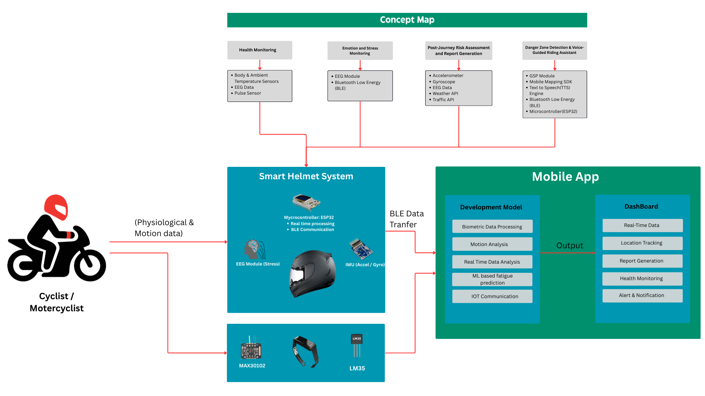
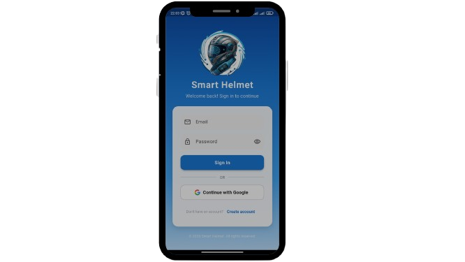
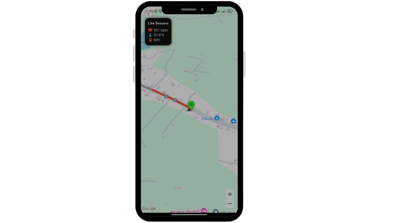
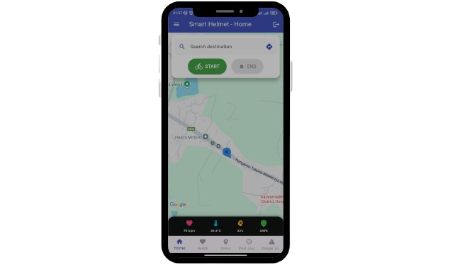

# Smart Helmet 🚀

<p align="center">
  
</p>

<p align="center">
  <a href="https://github.com/Yasiru3875/Smart-Helmet/stargazers"></a>
  <a href="https://github.com/Yasiru3875/Smart-Helmet/network"></a>
  <a href="https://github.com/Yasiru3875/Smart-Helmet/issues"></a>
  
  
  
  
  
</p>

<p align="center">
  <i>An innovative IoT-based smart helmet enhancing safety for cyclists and motorcyclists through real-time monitoring and proactive alerts.</i>
</p>

## Table of Contents

- [Overview](#overview)
- [Features](#features)
- [Architecture](#architecture)
- [Dependencies](#dependencies)
- [Installation](#installation)
- [Usage](#usage)
- [Screenshots](#screenshots)
- [Contributors](#contributors)

## Overview

🌟 The **Smart Helmet** is a cutting-edge IoT wearable designed to revolutionize road safety for cyclists and motorcyclists. By integrating advanced sensors, machine learning, and real-time analytics, it monitors vital signs, detects stress and hazards, and provides actionable insights to prevent accidents and promote well-being.

This project continues from ID 25-26J-294 (2025) under SLIIT's IT specialization. Backed by WHO road safety data and IoT research, it empowers riders with proactive protection. The repo tracks full history via commits for transparency.

## Features

🔥 Standout features:

- 🩺 **Health Monitoring**: Real-time tracking of heart rate, temperature, and EEG for cardiac risk prediction and stress detection.
- 😌 **Emotion & Stress Feedback**: EEG-based stress classification with personalized tips like breathing exercises or music suggestions.
- ⚠️ **Danger Zone Alerts**: Pre-ride risk mapping using GPS/IMU/EEG data, with multilingual voice alerts (English/Sinhala).
- 📊 **Post-Ride Reports**: Contextual analytics combining weather, traffic, and behavior for risk insights and weekly summaries.
- 📞 **Emergency Response**: Hands-free voice commands (e.g., "Send Help") for instant notifications.
- 📈 **Coaching**: Positive reinforcement for safe habits and long-term health awareness.

## Architecture

🛠️ High-level system overview:

<p align="center">
  
</p>

### Core Components

- **Hardware**: ESP32, MAX30102 (heart rate), EEG, IMU, GPS.
- **Comm**: BLE/Wi-Fi.
- **App**: Flutter-based UI with voice rec (PicoVoice) and TTS.
- **Backend**: Firebase, TensorFlow Lite for ML.
- **APIs**: OpenWeatherMap, Google Traffic, Mapbox.

## Dependencies

<details>
<summary>📦 Click to expand dependencies</summary>

### Hardware

| Component          | Description               | Model/Example |
| ------------------ | ------------------------- | ------------- |
| Microcontroller    | Sensor processing & comms | ESP32         |
| Heart Rate Sensor  | Pulse monitoring          | MAX30102      |
| Temperature Sensor | Body heat tracking        | Integrated    |
| EEG Module         | Brainwave analysis        | Custom EEG    |
| IMU Sensor         | Motion detection          | MPU6050       |
| GPS Module         | Location services         | NEO-6M        |
| Audio              | Voice I/O                 | Mic & Speaker |

### Software

| Category | Dependencies                                 | Purpose                      |
| -------- | -------------------------------------------- | ---------------------------- |
| Firmware | Arduino IDE, ESP-IDF                         | ESP32 programming            |
| ML       | TensorFlow Lite, scikit-learn                | Predictions & classification |
| App      | Flutter, PicoVoice, Mapbox SDK               | UI, voice, maps              |
| Backend  | Firebase                                     | Storage & auth               |
| APIs     | OpenWeatherMap, Google Maps                  | Weather & traffic            |
| Other    | BLE libs, TTS (Google/Polly), R-tree/KD-tree | Comms, alerts, indexing      |

_Install via managers like `flutter pub get`. No runtime pip installs._

</details>

## Installation

<details>
<summary>🛠️ Click to expand installation steps</summary>

1. Clone repo:

   ```bash
   git clone https://github.com/Yasiru3875/Smart-Helmet.git
   cd Smart-Helmet
   ```

2. Assemble hardware: Wire sensors to ESP32 (see docs/hardware_guide.md).

3. Firmware: Upload from `firmware/` using Arduino IDE.

4. App: In `smart_helmet_app/`, run `flutter pub get`. Add API keys in config.

5. Cloud: Setup Firebase.

</details>

## Usage

📱 Quick start:

- Pair helmet via BLE in app.
- Input route & start ride for monitoring.
- Get alerts during ride.
- Review reports post-ride.
- Voice command for emergencies.

## Screenshots

<p align="center">
  <!-- Add your app screenshots here, e.g. -->
  
  
  
</p>

## Contributors

👥 Team:

- 🩺 **Vithanage K.W.Y.L.N (IT22595980)**: Health System
- 😌 **Samarakoon S.S.A.D.S.B (IT22207036)**: Stress Monitoring
- 📊 **Samarasinghe K.P.C (IT22608086)**: Risk Assessment
- ⚠️ **Primasha W.G.R (IT22216878)**: Danger Detection

**Supervisors**:

- Mr. Jagath Wickramarathne
- Mr. Amla Alexander
- Dr. Sajith Perera

PRs welcome!

<p align="center">
  ⭐ Star if useful! Issues/PRs open for feedback.
</p>
